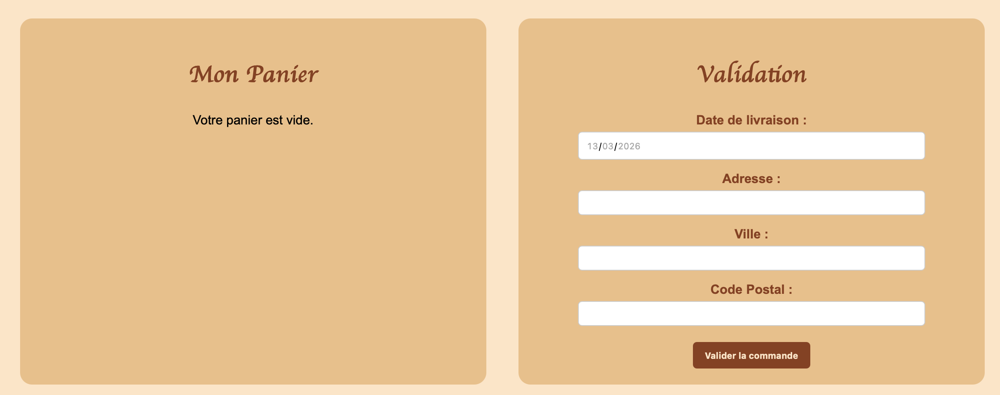

# 🥖 La Boulangerie du Village

Vous pouvez tester l'application en ligne ici : [La Boulangerie du Village](https://meriemezdari.github.io/Projet-La-Boulangerie-du-Village-BDD-MySQL)

## Présentation

**La Boulangerie du Village** est un site web permettant aux clients de consulter les produits d’une boulangerie, d’ajouter des articles au panier et de passer une commande.

Le paiement ne se fait pas directement sur le site : la commande est **payée à la livraison**.

Le site contient :

* une page d’accueil présentant la boulangerie
* une page produits avec un filtre par catégories
* une page d’inscription / connexion
* une page panier pour valider la commande
* une page d’informations pratiques

Le projet utilise **HTML, CSS, JavaScript, PHP et MySQL**.

---

## Utilisation du site

### Installation

1. Télécharger **tous les fichiers du projet** depuis ce dépôt GitHub.
2. Créer un dossier nommé **PROJET**.
3. Placer **tous les fichiers téléchargés dans ce dossier**.
4. Mettre le dossier dans :

Documents/Docker/docker-test/www/

5. Importer la base de données située dans :

documentation/boulangerie.sql

dans **PHPMyAdmin**.

6. Lancer **Docker**.

7. Ouvrir le site dans un navigateur :

http://localhost:8080/PROJET/index.html

---

## Aperçu du panier

GitHub ne permet pas d’exécuter les fichiers **PHP** dans le mode *Live Demo*.
La page **panier** n’est donc pas accessible directement depuis GitHub.

Voici une **capture d’écran du panier** pour montrer son fonctionnement :

